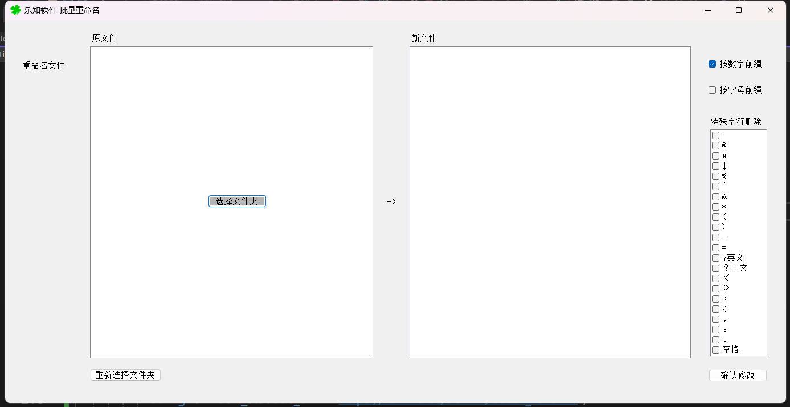
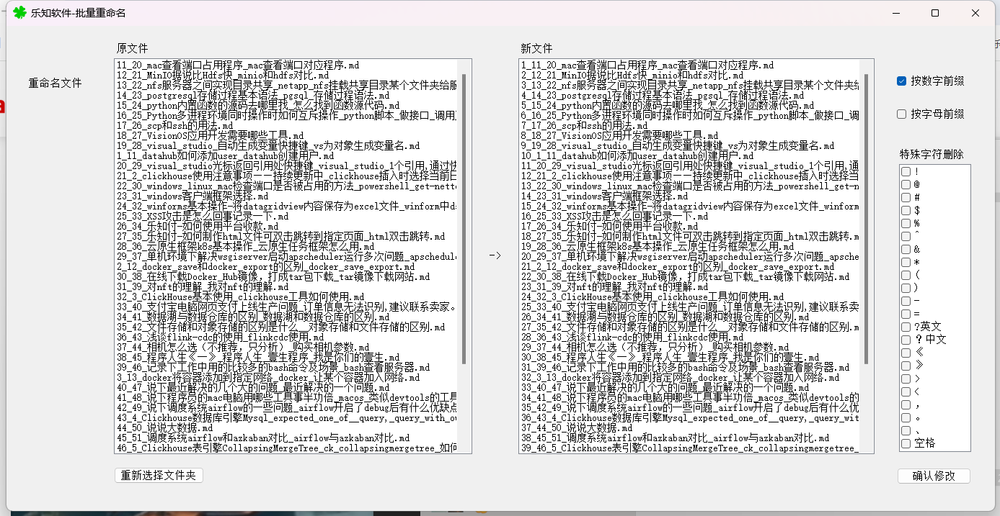

# 批量文件修改

1. 框架: winforms
2. .net framework: 4.8
3. dotnet version: 8.0.401

支持增加数字、字母前缀，还有文件名中特殊字符的替换。

# 批量文件夹修改
开发中。。。

---

祝导出愉快。

如果有任何问题，欢迎提issue。

本软件由【<b>乐知付加密平台</b>】开源，乐知付加密平台，是一个以用户为中心的内容变现平台，无论是专业创作者还是个人爱好者，都可以通过我们平台实现变现梦想。

您无需亲自搭建知识付费服务平台，将知识资源放在网盘中，通过加密平台，进行压缩包密码管理，买家支付后展示网盘中压缩包密码，轻松资源变现。

官网地址：[www.lezhifu.cc](https://lezhifu.cc)

公众号：

  
      

